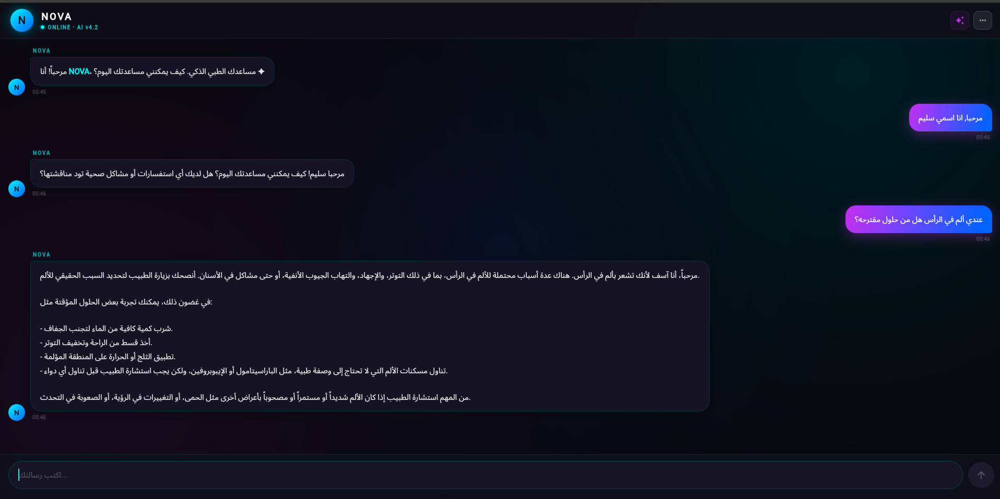

# 🏥 NovaChat — AI Medical Assistant

> A Flutter app integrated with AI to provide intelligent healthcare services in Arabic.

---

## ✨ Features

- 🤖 **AI Chatbot** — Powered by LLaMA 4 via Groq, responds in Arabic
- 🏥 **Healthcare Specialized** — Focused on medical advice and symptoms
- ⚡ **24/7 Cloud API** — Always online via Render
- 📱 **Professional UI/UX** — Modern dark theme with smooth animations
- 💬 **Real-time Chat** — Instant responses with typing indicators

---

## 🛠 Tech Stack

| Layer | Technology |
|-------|-----------|
| Frontend | Flutter (Dart) |
| Backend | Python FastAPI |
| AI Model | LLaMA 4 Scout via Groq API |
| Deployment | Render (Cloud) |

---

## 🌐 Live API

Backend deployed at:

```
https://rr-2-ih73.onrender.com
```

### Endpoint

```http
POST /chat
Content-Type: application/json

{
  "name": "user",
  "content": "your message here"
}
```

### Response

```json
{
  "reply": "AI response in Arabic"
}
```

---

## 🚀 Getting Started

### Prerequisites

- Flutter SDK `>=3.5.0`
- Python `>=3.10`
- Groq API Key

### Frontend Setup

```bash
git clone https://github.com/your-username/nova_chat.git
cd nova_chat
flutter pub get
flutter run
```

### Backend Setup

```bash
cd rayatukum-api
pip install -r requirements.txt
uvicorn main:app --reload
```

### Environment Variables

```bash
GROQ_API_KEY=your_groq_api_key_here
```

---

## 📁 Project Structure

```
nova_chat/               ← Flutter App
├── lib/
│   └── main.dart        ← Full UI + API integration
└── pubspec.yaml

rayatukum-api/           ← Python Backend
├── main.py              ← FastAPI + Groq integration
└── requirements.txt
```

---

## 📱 Screenshots




## 🤝 Contributing

Pull requests are welcome! For major changes, please open an issue first.

---

## 📄 License

MIT License © 2025 NovaChat


